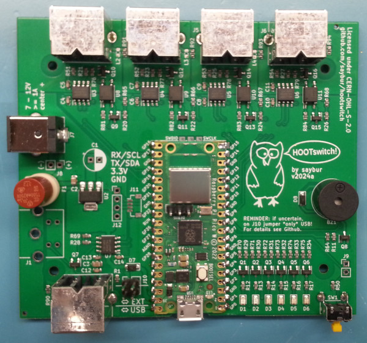

hootswitch
==========

Hootswitch is a prototype [ADB](https://en.wikipedia.org/wiki/Apple_Desktop_Bus)
multiplexer that allows peripherals (inluding keyboards and mice) to be shared
across up to four retro computers.



This project has two parts: an example hardware design and the firmware,
located in their respective folders in this repo.

Status
------

Basic ADB keyboards and mice are supported. Switching between computers works
via the button on the front or <kbd>Control</kbd> / <kbd>Option</kbd> /
<kbd>⌘</kbd> / <kbd>Shift</kbd> in sequence, followed by <kbd>1</kbd> -
<kbd>4</kbd> to choose a port.

The firmware is still under active development and many bugs remain. Other
types of ADB devices are not supported yet. No features based on the Pico W
wireless chip have not been implemented at this point.

This section will continue to be updated as progress is (hopefully) made.

Building
--------

You will need the Pico SDK and associated tooling. There is a setup script
[here](https://raw.githubusercontent.com/raspberrypi/pico-setup/master/pico_setup.sh)
that assumes you're using a Raspberry Pi as your development environment if you
want to try that; I personally use Debian _bookworm_ on a regular x86 system
instead, set up as follows.

Dependencies and associated tools:

```
sudo apt install git cmake gcc-arm-none-eabi gcc gdb-multiarch automake \
    autoconf build-essential texinfo libtool libftdi-dev libusb-1.0-0-dev \
    openocd
```

Clone the [Pico SDK](https://github.com/raspberrypi/pico-sdk). Execute
`git submodule update --init` in that project to get sub-libraries added. Set
`PICO_SDK_PATH` to point at where the SDK lives via `~/.bashrc` or equivalent;
something like `export PICO_SDK_PATH=/home/saybur/src/pico-sdk` would be
suitable after being adjusted for your environment.

Also clone or download [FreeRTOS](https://github.com/FreeRTOS). The LTS release
is likely fine. Set `FREERTOS_KERNEL_PATH` to the folder where
`FreeRTOS-Kernel` is located via the above method.

Once you have everything set up, build as follows from the root of the repo.

```
mkdir -p build
cd build
cmake ../firmware
make
```

Among other files, this will produce `hootswitch.uf2`. Make sure your power
selection is correct, then hold down the BOOTSEL button while you plug in
to your computer via USB. Copy the `.uf2` onto the new mass storage device.
Reboot.

Debugging
---------

You will want to invoke `cmake` with `-DCMAKE_BUILD_TYPE=Debug`.

[The official debugger](https://www.raspberrypi.com/documentation/microcontrollers/debug-probe.html)
is dirt cheap and works reasonably well if you plan to develop on the firmware.
It can be used as follows to upload without needing to fuss with the BOOTSEL
button. Be in the `dialout` group to avoid needing `sudo` all over the place.
OpenOCD can be started as follows.

```
openocd -c "set USE_CORE 0" -f interface/cmsis-dap.cfg -f target/rp2040.cfg \
    -c "adapter speed 5000" -c "rp2040.core0 configure -rtos FreeRTOS"
```

See <https://github.com/raspberrypi/pico-sdk/issues/1622> for a discussion
about `USE_CORE 0` above. The above is fine for now with the current state of
development, which runs only on a single core anyway.

In another terminal, run `gdb-multiarch hootswitch.elf`. Connect to the device
with `target remote localhost:3333` (or automate this step via `~/.gdbinit`).
See [the documentation](https://openocd.org/doc/html/General-Commands.html) for
specifics; the following commands are likely useful (with the caveat that I am
_most definitely_ not an authority on `gdb`):

* `load` will update programming with the current ELF.
* `monitor reset init` will restart and halt for instructions.
* `print X` prints information about something, including variables.
* `br X` adds a breakpoint at X, `del` removes one or more.
* `continue` will proceed, stopping at breakpoints; Ctrl-C halts.
* `finish` completes a function.
* `bt` prints a backtrace, `bt f` prints a backtrace with symbols.
* `up` and `down` moves around the frames of a call.
* `i r` prints registers.
* `p X` prints variable X.
* `p/x *0x0` prints in hex from the address, useful for peripheral registers.
* `i threads` prints information relevant to FreeRTOS thread execution.

Licenses
--------

Except where otherwise noted, all software is available under the GNU GPL v3.
The example hardware is available under the CERN Open Hardware Licence
strongly-reciprocal variant, version 2. Refer to the licenses for specific
terms.
